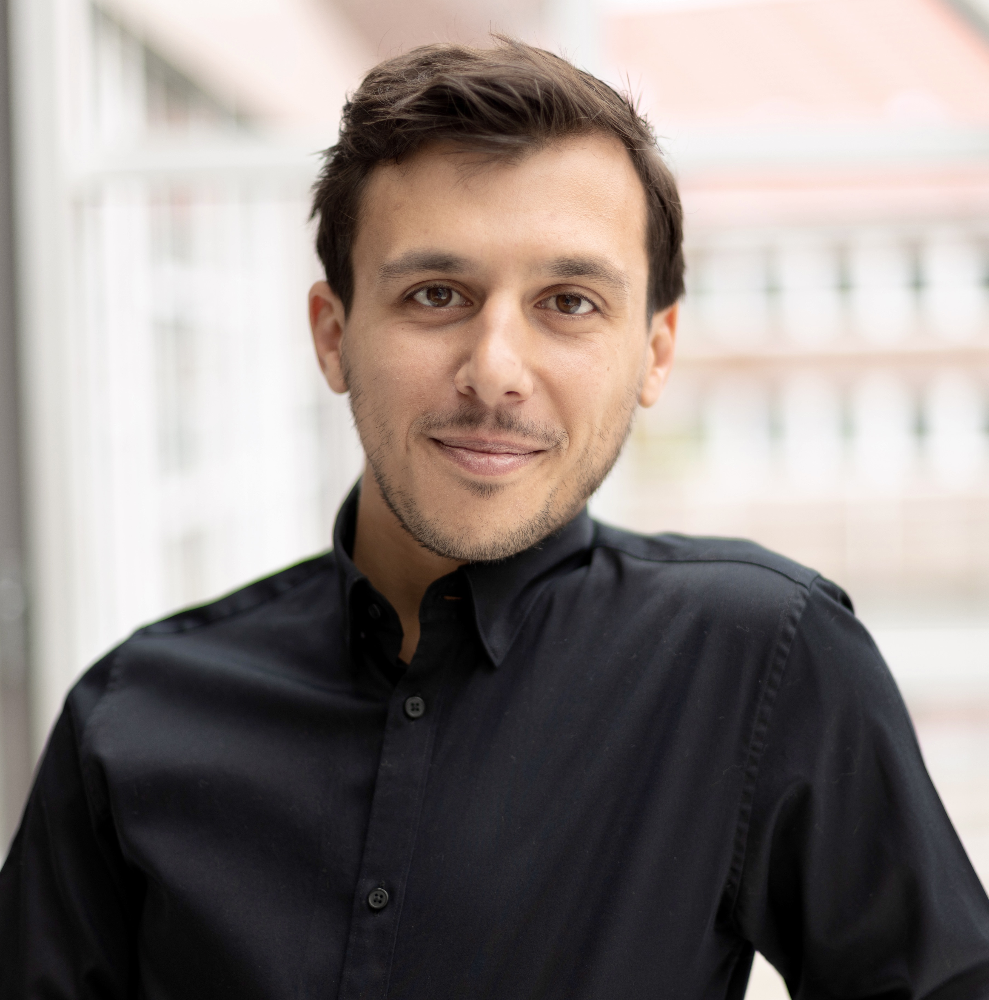

```{r, results='asis', echo=FALSE}
cat('
<style>
  body {
    font-size: 16px;
  }
  code {
    font-size: 12px;
  }
</style>
')
```


```{r setup, include = FALSE}

knitr::opts_chunk$set(echo = FALSE, warning = FALSE, message = FALSE)

library(vitae)
library(tibble)
library(dplyr)

```


```{r, out.width = "300px", out.height = "303px"}



```


## Personal Details

- **Date of Birth:** 05 October 1992
- **Nationality:** British


## Awards


```{r}

tribble(
  ~Year, ~Position, ~Organisation, ~Desc,

  "2024", 
  "Douglas C. West Advertising Creative Article Award",
  "",
  "I was first author of the paper *Musical Manipulation of Visual Scenes In Video, Film, and TV Advertisements*, which won the 2024 Douglas C. West Advertising Creative Article Award as assessed by the prestigious Advertising Research Foundation.",

  "06/2022 – 11/2025", 
  "Studienstiftung des deutschen Volkes PhD Scholarship", 
  "52,200 €",
  "4-year doctoral scholarship granted to highly qualified and socially committed researchers. The Studienstiftung (German National Academic Foundation) is one of the largest and most prestigious organizations for the promotion of gifted students in Germany: <https://www.studienstiftung.de/>.",

  "12/2020 – 12/2021", 
  "DAAD PhD Scholarship", 
  "14,935 €", 
  "1-year doctoral scholarship granted to talented researchers. The DAAD (German Academic Exchange Service) is the world’s largest funding organisation for the international exchange of students and researchers: <https://www.daad.de/>."
) %>%
  mutate(Empty = "") %>%
  detailed_entries(
    when = Year,
    what = Position,  # instead of Empty
    with = Organisation,
    why = Desc,
    where = ""        # if location is not applicable
  )

```


## Current Roles

```{r}

tribble(
  ~Year, ~Position, ~Organisation, ~Desc,
  
   "2020-present", "PhD Researcher", "Hochschule für Musik, Theater und Medien, Hannover", "Project: Playing By Ear: A Computational Approach",
  
  "2023-present", "Data Scientist,  Programmer", "Diaes4All Project, University of Tübingen", "Co-managing research project and building technical architecture to track users' learning of musical items over the long-term using statistical modelling and web APIs.",
  
  "2022-present", "Data Scientist", "SoundOut/DataZ", "Working in the field of sonic branding and using DevOps/MLOps, R, Python, Amazon Web Services, machine learning, and related skills to deliver a wide range of practical solutions.",
  
  "2022-present", "Lead Lecturer, Psychology of Music", "BIMM University, London", "Designed and maintain a new Psychology of Music course which runs one semester per year.") %>%
  mutate(Empty = "") %>% 
  detailed_entries(
    when = Year,
    what =  Empty,
    with = Organisation,
    why = Desc,
    where = Position) 

```


## Previous Roles

```{r}

tribble(
  ~Year, ~Position, ~Organisation, ~Desc,
  
  "2022", "Research Scientist", "Goldsmiths University", "Research Scientist on Innovate UK-funded project responsible for analyzing large datasets and producing three academic manuscripts.",
  
  "2017-2023", "Company Director, Tutor of Saxophone and Piano", "Hop Music, London", "Co-founded company in South East London employing several music teachers and working as a tutor. Day-to-day managing of lesson scheduling and company management."
) %>%
  mutate(Empty = "") %>% 
  detailed_entries(
    when = Year,
    what =  Empty,
    with = Organisation,
    why = Desc,
    where = Position) 

```

## Freelance Programming and Data Science Consultant Work (2020-Present)

```{r}
  
tribble(
  ~Year, ~Organisation, ~Desc, ~Role,
  
  "2023", 
  "Max Planck Institute", 
  "Creation of Rhythm Tapping Test and adaption of singing test for children populations.",
  "Programmer",
  
  "2023", 
  "ABCD Study", 
  'Development of new gamified test infrastructure for the largest long-term study of brain development and child health in the United States, the ABCD Study.',
  "Data Scientist, Programmer",
  

  "2021", 
  "AIRs Singing Project, University of Prince-Edward Island", 
  "Development of a new generation test infrastructure for AIRs Singing Project, following the development of singing abilities in teenage and adult populations.",
  "Programmer",
  
    
  "2021", 
  "Western Sydney University", 
  "Programming tutorial preparation to help researchers implement psychological tests easily.",
  "Programmer") %>%
  mutate(Empty = "") %>% 
  detailed_entries(
    when = Year,
    what =  Empty,
    with = Organisation,
    why = Desc,
    where = Role)

```


## Education

```{r}
  
tribble(
  ~Year, ~Institution, ~Degree, ~Award, ~Info,
  
  "2019 – 2020", 
  "Goldsmiths University, London",
   "Computational Cognitive Neuroscience, MSc",
  "First class honours",
  "Thesis: “Predicting production from dirty data: Psychometric and Big Data approaches to melodic production",
    
  
  
    "2016 – 2019",
    "Goldsmiths University, London",
    "Psychology with Cognitive Neuroscience, BSc",
    "First class honours", 
    "Thesis: “Does musical training improve general working memory? A causal modelling approach to the associations between general working memory, musical working memory and musical training.",

"2011 – 2014",
"Middlesex University, London",
"Music (Jazz Saxophone Performance), BA",
"Upper second-class honours",
"")  %>%
  mutate(Empty = "") %>% 
  detailed_entries(
    when = Year, where = Institution, what = Degree, with = Award, why = Info)


```


## Publications

```{r}
bibliography_entries("seb_papers.bib") %>%
  arrange(desc(issued))

```

## Conferences

```{r}
bibliography_entries("seb_conferences.bib") %>%
  arrange(desc(issued))

```
